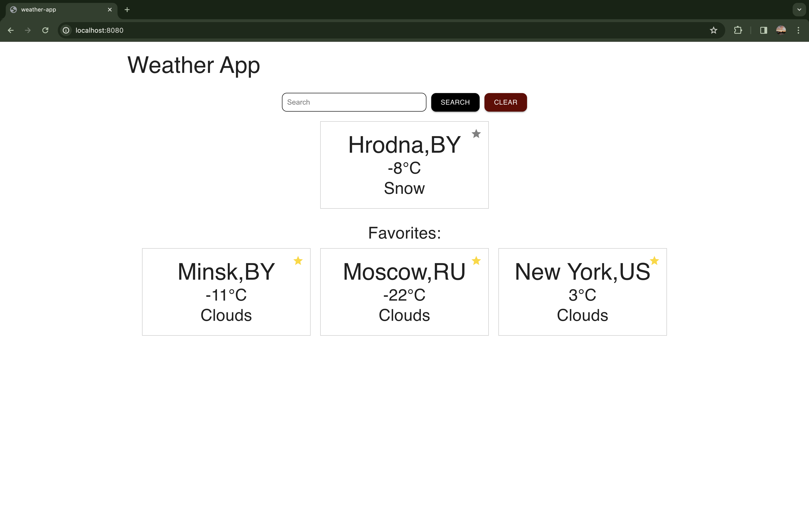

# weather-app

Это небольшое веб-приложение, созданное с использованием React, TypeScript, Webpack и библиотеки Material-UI. Приложение предоставляет информацию о погоде для выбранных городов и позволяет добавлять их в избранное.

